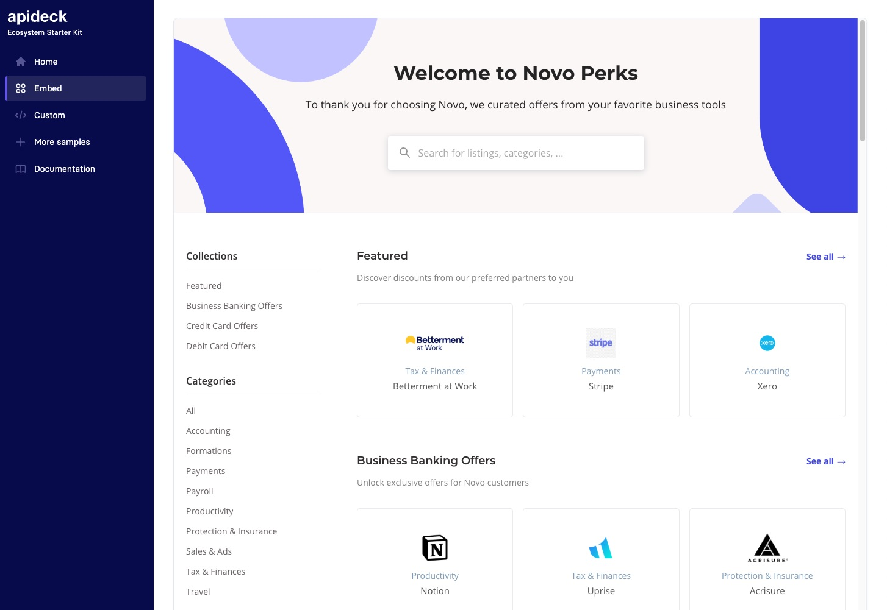
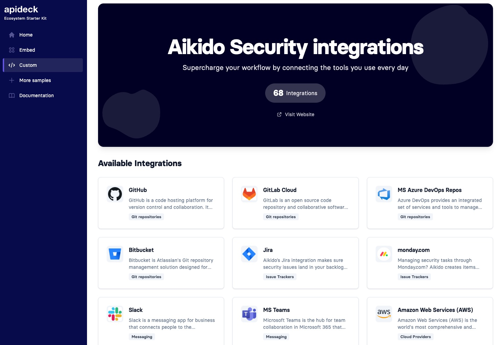

# Ecosystem Starter Kit


#### A starter kit for integrating [Apideck Ecosystem](https://www.apideck.com/ecosystem) into your application.

Showcase two powerful approaches to integrate Apideck Ecosystem: embed a fully-featured marketplace with an iframe, or build a custom experience using the Ecosystem API.
<br>

## Quick overview

Execute [`create-next-app`](https://github.com/vercel/next.js/tree/canary/packages/create-next-app) with [npm](https://docs.npmjs.com/cli/init) or [Yarn](https://yarnpkg.com/lang/en/docs/cli/create/) to bootstrap the starter kit:

```bash
npx create-next-app --example https://github.com/apideck-samples/ecosystem-starter-kit
# or
yarn create next-app --example https://github.com/apideck-samples/ecosystem-starter-kit
```

## Screenshots

### Embed Approach



### Custom API Approach



## Tech Stack

- **Next.js 15** - React framework with App Router
- **React 18** - React with improved performance
- **TypeScript 5.7** - Type safety
- **Tailwind CSS 3.4** - Utility-first CSS framework
- **TanStack Query 5** - Data fetching and state management

## What is Apideck Ecosystem?

[Apideck Ecosystem](https://www.apideck.com/ecosystem) allows you to create and manage a branded integration marketplace for your application. You can:

- Showcase available integrations to your users
- Provide a searchable, filterable catalog of integrations
- Maintain consistent branding across your integration experience
- Update and manage integrations from a central dashboard

## Getting started

### Requirements

- **An Apideck Ecosystem account**: Sign up at https://www.apideck.com/ecosystem
- **Ecosystem ID**: Get your ecosystem ID (UUID format) from your [Apideck Ecosystem dashboard](https://platform.apideck.com/ecosystem)

### Features

- 🎨 **Two Integration Approaches** - Choose between iframe embed or custom API implementation
- 🌐 **Embed Examples** - Interactive carousel showcasing live ecosystem marketplaces
- 🔌 **API Example** - Custom integration using the Ecosystem API
- 📱 **Responsive Design** - Mobile-first design that works on all devices
- ⚡ **Modern Stack** - Built with Next.js 15, React 18, and TypeScript

### Step 1: Install dependencies

```bash
yarn install
# or
npm install
```

### Step 2: Run the development server

```bash
yarn dev
# or
npm run dev
```

Visit `http://localhost:3000/` to see the starter kit in action.

### Step 3: Choose your integration approach

The starter kit includes two implementation examples:

#### **Option 1: Embed Ecosystem (Recommended for quick start)**

Navigate to `/embed` to see how you can embed a fully-featured integration marketplace directly into your application using an iframe.

**Pros:**

- Quick and easy implementation
- Fully branded marketplace experience
- No backend development required
- Automatic updates and maintenance

**Use this when:**

- You want to get up and running quickly
- You prefer a managed solution
- You don't need deep customization of the UI

#### **Option 2: Custom Integration (API approach)**

Navigate to `/custom` to see how you can build a custom integration marketplace using the Ecosystem API.

**Pros:**

- Complete control over UI/UX
- Programmatic access to all ecosystem data
- Build custom workflows and logic
- Deep integration with your application

**Use this when:**

- You need full control over the user experience
- You want to build custom features or workflows
- You need to integrate deeply with your existing application

## Project Structure

```
src/
├── app/                    # App Router pages and API routes
│   ├── api/               # API Route Handlers
│   │   └── ecosystem/     # Ecosystem API endpoints
│   │       └── listings/  # Listings endpoint
│   ├── custom/            # Custom integration page (API approach)
│   ├── embed/             # Embed ecosystem page (iframe approach)
│   ├── layout.tsx         # Root layout with providers
│   └── page.tsx           # Home page with approach selection
├── components/            # React components
│   ├── listings/          # Listing-specific components
│   ├── Layout.tsx
│   ├── PageHeading.tsx
│   ├── PageLoader.tsx
│   ├── SidebarLayout.tsx
│   └── Spinner.tsx
├── lib/                   # Utility libraries
│   └── apideck.ts         # Apideck SDK initialization
├── providers/             # React context providers
│   ├── client-providers.tsx
│   └── query-provider.tsx
├── styles/                # Global styles
├── types/                 # TypeScript types
└── utils/                 # Utility functions and hooks
    ├── useListings.tsx    # Hook for fetching ecosystem listings
    └── index.ts
```

## Implementation Details

### Embed Ecosystem Page (`/embed`)

The embed page demonstrates how to integrate Apideck Ecosystem using an iframe. This is the quickest way to get started.

**Key features:**

- Interactive carousel with 10+ live ecosystem examples
- Full-screen iframe viewer with navigation controls
- Loading states and transitions
- Demonstrates the `?embed=true` parameter for optimized embedding
- **URL Parameter Support**: Link directly to a specific ecosystem by adding `?ecosystemId=YOUR_ECOSYSTEM_ID` to the URL

**Direct linking example:**

Share a direct link to your ecosystem with customers:

```
https://your-app.com/embed?ecosystemId=cjm81i5c9wnbl0931dvhgawzu
```

**Session-based Preview Mode:**

When an `ecosystemId` parameter is provided:

- The ecosystem selector is automatically hidden
- Only the specified ecosystem is displayed
- The session is stored in `sessionStorage` and persists across page navigation
- All internal navigation links automatically preserve the ecosystem context
- The home page shows a preview mode banner with the ecosystem name
- Perfect for customers to preview their specific ecosystem without seeing other options

This means if a customer lands on `/embed?ecosystemId=X`, they can navigate to `/custom` or any other page and the ecosystem context is maintained throughout their session.

**Basic implementation:**

```tsx
<iframe
  src="https://your-ecosystem.apideck.io/?embed=true"
  className="w-full h-full border-0"
  title="Integration Marketplace"
/>
```

### Custom Integration Page (`/custom`)

The custom page demonstrates how to build your own integration marketplace using the Ecosystem API.

**Key features:**

- Dynamic ecosystem hero section with branding
- Fetches ecosystem data and listings from the API
- Custom card-based grid layout with modal details
- Pagination support
- Loading and error states
- Markdown support for listing descriptions
- Dynamic variable injection (e.g., `%ecosystem%`, `%listing_naming%`)
- Optimized Cloudinary image handling
- Smart text color detection for light/dark backgrounds
- **URL Parameter Support**: Link directly to a specific ecosystem by adding `?ecosystemId=YOUR_ECOSYSTEM_ID` to the URL

**Direct linking example:**

Share a direct link to showcase a specific ecosystem:

```
https://your-app.com/custom?ecosystemId=cjm81i5c9wnbl0931dvhgawzu
```

When an `ecosystemId` parameter is provided, the ecosystem selector is hidden and only the specified ecosystem&apos;s custom integration view is displayed. Like the embed page, the ecosystem context persists across navigation throughout the session.

**API Usage:**

The starter kit includes Next.js API routes that proxy requests to the Apideck Ecosystem API:

- `/api/ecosystem/[id]/route.ts` - Fetch ecosystem details
- `/api/ecosystem/listings/route.ts` - List all listings
- `/api/ecosystem/listings/[id]/route.ts` - Get single listing details

This pattern is recommended to keep your API credentials secure and avoid CORS issues.

### Components

#### Layout Components

- **Layout** - Main layout wrapper with sidebar navigation
- **SidebarLayout** - Sidebar navigation with branding
- **PageHeading** - Reusable page header component with optional action buttons
- **PageLoader** - Loading state component
- **Spinner** - Loading spinner component

#### Listing Components

- **Listings** - Displays ecosystem listings grid with pagination
- **ListingCard** - Individual listing card with click-to-open modal
- **ListingDetails** - Full listing details shown in modal with markdown support
- **EcosystemHero** - Dynamic hero section with branding and background images
- **EcosystemSelector** - Dropdown for selecting ecosystems

#### UI Components

- **Dialog** - Headless UI based dialog/modal system
- **Markdown** - Markdown renderer with custom styling for listing content

## Embedding Apideck Ecosystem in Your Application

If you have an [Apideck Ecosystem](https://www.apideck.com/ecosystem) marketplace, you can embed it into your application using an iframe.

### Getting Your Ecosystem URL

1. Sign up for Apideck Ecosystem at https://www.apideck.com/ecosystem
2. Create and customize your integration marketplace
3. Get your unique ecosystem URL (e.g., `https://your-company.apideck.io/`)

### Basic Implementation

```tsx
<iframe
  src="https://your-company.apideck.io/?embed=true"
  width="100%"
  height="800px"
  style={{ border: 0 }}
  title="Integration Marketplace"
/>
```

**Important**: Add `?embed=true` query parameter to optimize the display for embedding.

### Full-Page Implementation

```tsx
'use client'

export default function EcosystemPage() {
  return (
    <div className="flex flex-col h-screen">
      <div className="flex-1 relative overflow-hidden">
        <iframe
          src="https://your-company.apideck.io/?embed=true"
          className="w-full h-full border-0"
          title="Integration Marketplace"
        />
      </div>
    </div>
  )
}
```

See `src/app/embed/page.tsx` for a complete example with loading states and navigation.

## Using the Ecosystem API

To build a custom integration marketplace, you can use the Ecosystem API to fetch listings programmatically.

### API Specification

The complete Ecosystem API specification is available in OpenAPI 3.0 format:

**📄 [View API Spec](https://raw.githubusercontent.com/apideck-libraries/openapi-specs/main/ecosystem.yml)**

This specification includes all available endpoints, request/response schemas, and data types for building custom solutions.

### API Configuration

The starter kit includes an example API route that proxies requests to the Apideck Ecosystem API:

```typescript
// src/app/api/ecosystem/listings/route.ts
export async function GET(request: Request) {
  const { searchParams } = new URL(request.url)
  const ecosystemId = searchParams.get('ecosystem_id')

  // Fetch listings from Apideck Ecosystem API
  const response = await fetch(
    `https://api.apideck.com/ecosystem/listings?ecosystem_id=${ecosystemId}`,
    {
      headers: {
        Authorization: `Bearer ${process.env.APIDECK_API_KEY}`,
        'X-APIDECK-APP-ID': process.env.APIDECK_APP_ID || ''
      }
    }
  )

  return response
}
```

### Custom Hooks

The starter kit includes custom hooks for data fetching:

```typescript
// Fetch ecosystem details
import { useEcosystem } from '@/utils/useEcosystem'

const { data: ecosystem, isLoading, error } = useEcosystem(ecosystemId)

// Fetch listings
import { useListings } from '@/utils/useListings'

const { listings, isLoading, error, nextPage, previousPage, hasNextPage, hasPreviousPage } =
  useListings(ecosystemId)
```

### Utility Functions

The starter kit provides utilities for ecosystem data processing:

```typescript
import {
  getListingName,
  injectTags,
  transformCloudinaryImage,
  ensureHexColor,
  capitalizeFirst
} from '@/utils/ecosystem-utils'

// Get correct listing terminology (integrations, apps, etc.)
const listingName = getListingName(ecosystem)

// Inject dynamic variables into text
const text = injectTags('Connect %ecosystem% %listing_naming%', { ecosystem })

// Optimize Cloudinary images
const optimizedUrl = transformCloudinaryImage(imageUrl, 1920)

// Ensure color has # prefix
const color = ensureHexColor('242424') // Returns '#242424'
```

## Commands

#### `yarn dev` or `npm run dev`

Runs `next dev` which starts the app in development mode.<br>
Open [http://localhost:3000](http://localhost:3000) to view it in the browser.

#### `yarn build` or `npm run build`

Runs `next build` which builds the application for production usage

#### `yarn start` or `npm start`

Runs `next start` which starts a Next.js production server

#### `yarn lint` or `npm run lint`

Runs the Next.js built-in ESLint command for all files.

#### `yarn lint:fix` or `npm run lint:fix`

Runs the ESLint command with the `--fix` flag which tries to automatically fix linting problems.

#### `yarn format` or `npm run format`

Runs Prettier which formats all files inside the `src` directory based on the configuration set inside the `.prettierrc` file.

#### `yarn type-check` or `npm run type-check`

Runs the `tsc` command to compile the project and check if it has type errors.

## Resources

To learn more, take a look at the following resources:

### Apideck Resources

- [Apideck Ecosystem](https://www.apideck.com/ecosystem) - Create branded integration marketplaces
- [Ecosystem API Documentation](https://developers.apideck.com/apis/ecosystem/reference) - Documentation of the Ecosystem API
- [Apideck Platform](https://platform.apideck.com) - Manage your ecosystem and integrations
- [Apideck Samples](https://www.apideck.com/samples) - More sample projects and starter kits

### Development Resources

- [Next.js Documentation](https://nextjs.org/docs) - Learn about Next.js features and API
- [Next.js App Router](https://nextjs.org/docs/app) - Learn about the App Router
- [TypeScript](https://www.typescriptlang.org/) - Learn about TypeScript
- [Tailwind CSS](https://tailwindcss.com/) - Learn about the utility-first CSS framework
- [TanStack Query](https://tanstack.com/query/latest) - Learn about powerful data fetching
- [ESLint](https://eslint.org/) - Learn about analyzing code with ESLint
- [Prettier](https://prettier.io/) - Learn about formatting code with Prettier

## Support

Need help? Check out:

- [Apideck Documentation](https://developers.apideck.com)
- [Apideck Support](https://www.apideck.com/support)
- [GitHub Issues](https://github.com/apideck-samples/ecosystem-starter-kit/issues)

## License

MIT
